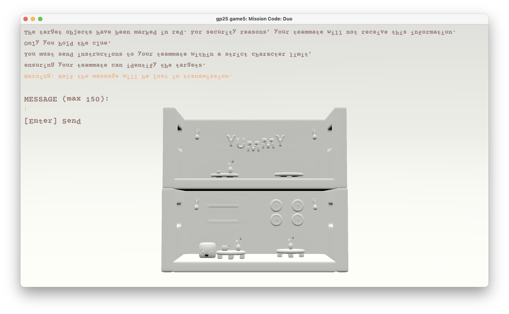

# Misson Code: Duo

## Author

Cheyu Tu

## Design

> What is new and interesting about this game?

This is a two-player game. Players are secret agents investigating a restaurant to uncover hidden clues crucial to their next mission. One player will provide instruction, the other deciphers it to locate the hidden items.

## Networking

> How is the client/server multiplayer in this game? What messages are transmitted? Where in the code?

1. Role selection

Only one player can be the communicator, and the other will be the operative. In the start scene, players will use their up/down keys to select the role, and hit Enter to get ready. If the player selects a role that the other player has selected, they will force the other player to the other role. Specifically:

- When Player 1 (P1) use the keys to switch selection, the currently selected role (`selected_role_1`) will be stored in a variable sent to server via `send_selected_role_message` in Game.hpp/cpp.

- When P1 selects Communicator and hits **Enter**, the P1 client sends its chosen enum (`Role::Communicator`) via `send_login_message`  Game.hpp/cpp.

- The **server** sets a variable `role_1` to P1's chosen role. If P2 has already selected the communicator and is ready, P2 will be forced to select the operative role. `selected_role_2` will be set to the operative role, and P2's ready state will be canceled.

- Players will stay in the start scene unless both roles are complementary, in which case they will proceed to the next scene `phase = Communication`.

- Every snapshot in **Lobby** carries `role_1/role_2` and `selected_role_1/selected_role_2`. If the current player is ready while the other is not, The “Log In” label turns to “Waiting for your teammate…”.

2. Instruction message

When in Communication phase and Communicator role, if player types Enter and input_text.size() > 0, then:

- send the instruction text to server via `send_instruction_message` in Game.hpp/cpp.

- Change the phase from Communication to Operation

- for both players (Communicator and Operator), in Operation phase, the text typed by Communicator in the Communication phase will be displayed on the screen.

- After go from Communication to Operation phase, **randomly replaces 50% of non-space, characters** with `"*"` to simulate corrupted communication. Store that as `corrupted_instruction`

- In Operation phase, show the corrupted instruction instead of the original instruction.

    - on communicator’s screen, show: “Instruction Received”, then the corrupted instruction

    - on operative screen, just show: “Instruction”, then the corrupted instruction

## Screen Shot:



## How To Play:

> describe the controls and (if needed) goals/strategy.

1. Start a local server:
```
./dist/server 30000
```

2. Connect to the server as player 1:
```
./dist/client localhost 30000
```

3. In a new terminal window, connect to the server as player 2:
```
./dist/client localhost 30000
```

4. In the start scene, use up and down arrows to select a role. Hit Enter when you are ready.

5. When both players are ready, they will see the restaurant scene. 

6. The communicator will see five objects will be highlighted in a distinct color (I haven't implemeted this yet). They are the target objects. It's time for the communicator to describe what those objects are. Press Enter to send the instruction message when done.

7. 50% of thhe instruction message will be corrupted (replaced by "*"). The operator's job is to locate the target objects from the scene within limited attempts based on the corrupted instruction.

8. The operator can click on the scene to select an object. (I only partially implemented the object collision. If you click on the little guy on the left bottom corner, you should see a "hit Adult.001" in the terminal).

9. If the operator finds all target objects within 25 clicks, game success. (I haven't implemented this yet).


## Sources:

> list a source URL for any assets you did not create yourself. Make sure you have a license for the asset.

- https://www.blenderkit.com/get-blenderkit/7666f504-12b6-4015-a19e-57f451cd7bf4/
- https://www.blenderkit.com/get-blenderkit/8f413ad2-6328-4f89-b401-c9b497273408/
- https://www.blenderkit.com/get-blenderkit/46076e7d-530b-43a1-8b81-f103745a4b29/
- https://fonts.google.com/specimen/Courier+Prime?preview.layout=grid&query=courier

This game was built with [NEST](NEST.md).